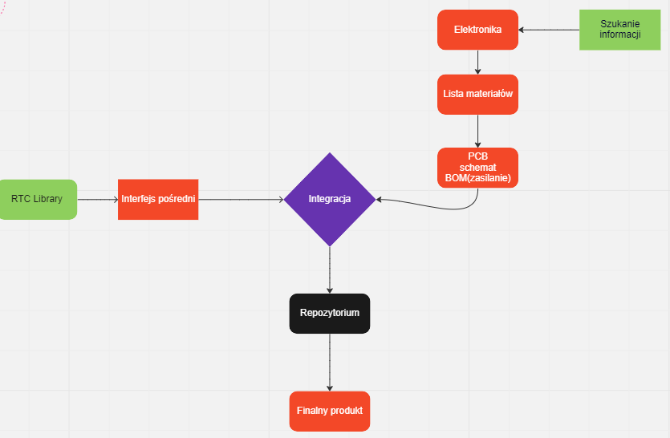
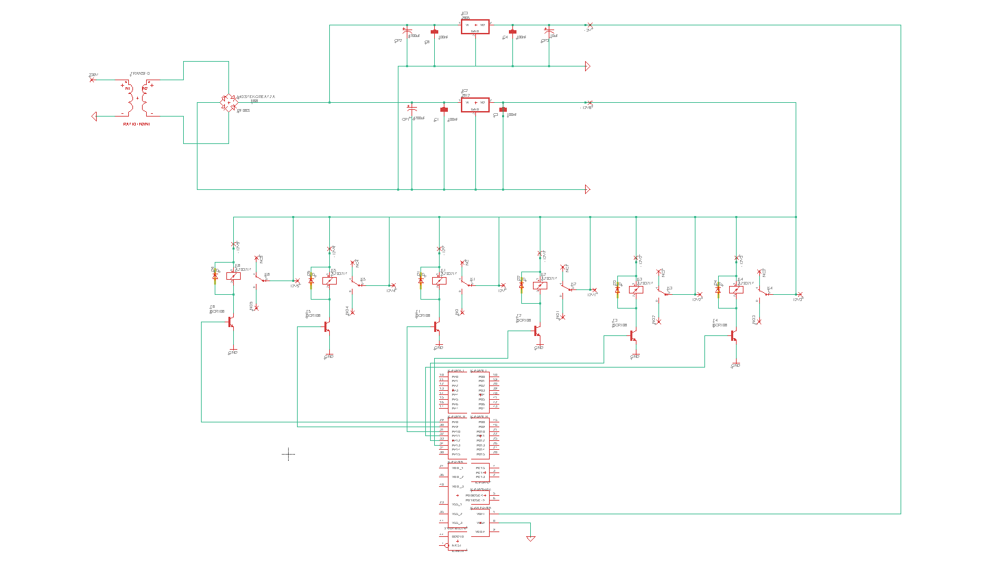
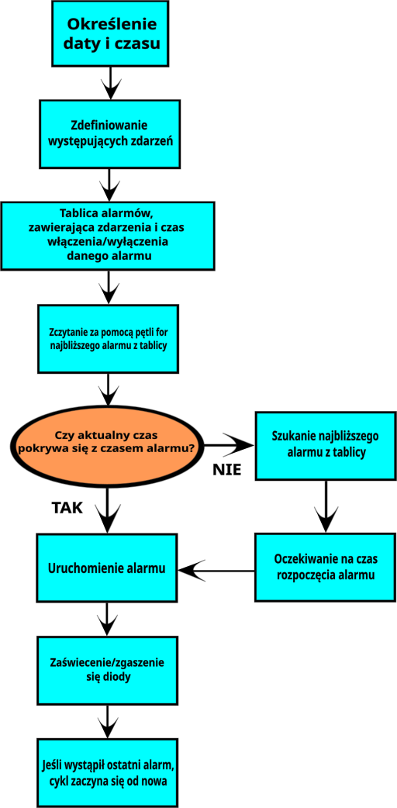

# System irygacji TytusPro

Aktualnie nasza firma “TytusPro”  zajmuję się realizacją projektu zautomatyzowanego systemu irygacyjnego stosowanego do nawadniania growboxa metodą deszczowania, czyli wytwarzania sztucznego deszczu poprzez deszczownicę. Do naszego urządzenia włączyliśmy 12 voltową pompę wody, oraz system rur aluminiowych. Nie zabrakło również lampy HPS która jest dopasowywana do danego growboxa w zależności od zapotrzebowania na moc (jeśli chodzi o małe pojemniki będzie to 250W). Sam growbox będzie wykonany z kawałków płyty wiórowej oraz listew. Woda jest dostarczana weżykiem do dysza zraszającego. Całe urządzenie funkcjonjuje pod zaprogramowanym zegarem który w zależności od cyklu dnia bądź nocy uruchamia światło jak i mechanizm zraszający naszą roślinę. Po całkowitej integracji urządzenia możesz udać się nawet na długie wakacje pozostawiając roślinę w naszych rękach. TytusPro dbamy o twoją zieleń!


## Plan działania 




# Elementy potrzebne do zbudowania naszego systemu wraz z ich parametrami

1. Pompa Wody
    - zasilanie 12V
    - wężyk o długości min. 150cm
    - średnica wylotu 1cm
    - wysokość podnoszenia wody wystarczy do 2,5/3 metrów
    - ciśnienie od 0,4 do 0,6 Bara

2. Oświetlenie – lampa HPS:
    - zależnie od warunków moc 250W lub 400W (bardziej 250W dla małego growboxa)

3. Wentylator:
    - około 30 wymian powietrza na godzinę
    - zasilanie 12V

4. Gniazdo e40 do lamp HPS

5. Przykładowe wymiary i materiały do budowy growboxa:]
    - 3 kawałki sklejki lub płyty wiórowej o wymiarach  1,21 metra x 2,42 metra i grubości  1,27 cm, przecięte na pół aby uzyskać sześć kawałków o wymiarach 1,21 m) x 1,21 m
    - 6 listew o szerokości 3,8 cm, grubości 3,8 cm i długości 2,43 m

6. Rury aluminiowe:]
    - średnica 1 cm
    - długość rur do 2/3 metrów

7. Kolanka aluminiowe:]
    - średnica 1 cm

8. Kable miedziane 2-żyłowe na napięcie 12V][]

9. Dysza do zraszania
    - średnica 1cm

# Schemat poglądowy systemu iregacyjnego


# Algorytm blokowy


# Opis fragmentów kodu

 - Czas i data uruchomienia

```C
RTC_Datetime_t datetime_start = {         
  .year = 23,
  .month = 02,
  .month_day = 03,                        
  .hour = 16,
  .minute = 00,
  .second = 00
};
```
- Zadeklarowane zdarzenia

```C
typedef enum {                          
	EVENT_Enable_Sun,
	EVENT_Enable_Water,
	EVENT_Enable_Air,
	EVENT_Disable_Sun,
	EVENT_Disable_Water,
	EVENT_Disable_Air,
} Event_e;
```
- Tablica alarmów, którą ustawiamy przed programowaniem urządzenia. Alarmy mają następować po sobie.

```C
 Alarm_t alarm_array[ALARM_COUNT] = {         
		{ .event = EVENT_Enable_Sun, .alarm = { .day_mask = true, .hour = 8, .minute = 0, .second = 0 } },
		{ .event = EVENT_Enable_Air, .alarm = { .day_mask = true, .hour = 12, .minute = 0, .second = 0 } },
		{ .event = EVENT_Enable_Water, .alarm = { .day_mask = true, .hour = 15, .minute = 0, .second = 0 } },
		{ .event = EVENT_Disable_Water, .alarm = { .day_mask = true, .hour = 15, .minute = 3, .second = 0 } },
		{ .event = EVENT_Disable_Air, .alarm = { .day_mask = true, .hour = 18, .minute = 0, .second = 0 } },
		{ .event = EVENT_Disable_Sun, .alarm = { .day_mask = true, .hour = 22, .minute = 0, .second = 0 } }
};
```
- Pętla for sprawdzająca najbliższy alarm z tablicy (NIE DZIAŁA)

```C
 for (uint8_t i = 0; i < ALARM_COUNT; i++) {                
    if(datetime_start.hour >= alarm_array[i].alarm.hour &&
       datetime_start.minute >= alarm_array[i].alarm.minute &&
	   datetime_start.second >= alarm_array[i].alarm.second) {

        RTC_Alarm_A_Enable(&(alarm_array[i].alarm));
 ```
- Event świadczy o obsłudze danego alarmu    

```C
 while(1)
		  {
			if(RTC_Event_A()) {

				switch(alarm_array[alarm_now].event) {         
				  case EVENT_Enable_Sun:
					  //for enable sun
					  break;
				  case EVENT_Enable_Air:
					  //for enable air
					  break;
				  case EVENT_Enable_Water:
					  //for enable water
					  break;
				  case EVENT_Disable_Water:
				  	  //for disable water
					  break;
				  case EVENT_Disable_Air:
					  //for disable air
					  break;
				  case EVENT_Disable_Sun:
					  //for disable sun
				  	  break;

				}
```
- Zwiększamy alarm o jeden, jeżeli nasz alarm jest większy bądź równy to zaczynamy od początku.
```js

				alarm_now++;                      
				if(alarm_now >= ALARM_COUNT) alarm_now = 0;     
				RTC_Alarm_A_Enable(&(alarm_array[alarm_now].alarm));

			  __NOP();
			}
			__NOP();
		  }
		 }

  }
}
```
#  Co należy dodać w przyszłości?

- Poprawić pętle for

- Ustawić pod przyciskiem aktualny czas 


